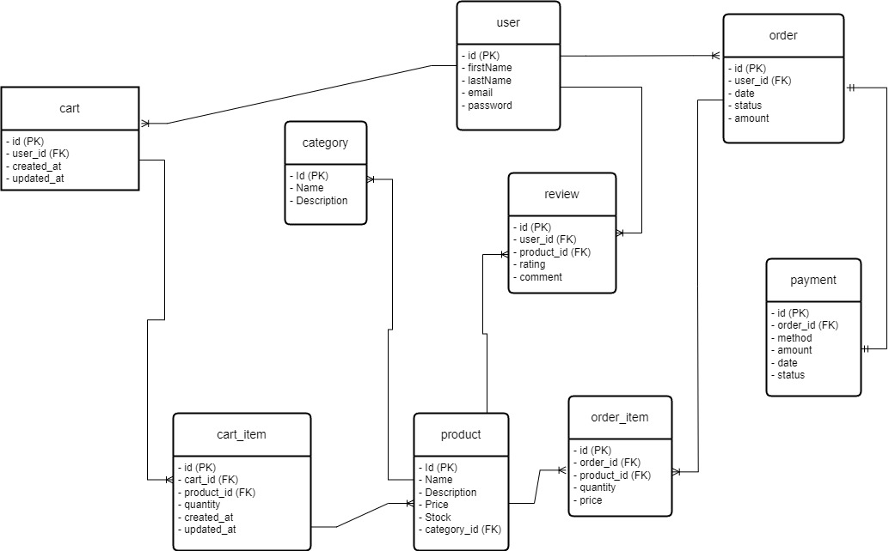

# Toko Online
The "Toko Online" project is a web-based e-commerce application developed as part of my personal portfolio. This application is built using Spring Boot and SQL technologies to provide a responsive and secure e-commerce platform for users to browse, search, and purchase products online.

## Features
* User registration and login with JWT authentication
* Password encryption using BCrypt
* Role-based authorization with Spring Security
* Customized access denied handling
* Logout mechanism
* Refresh token

## Technologies
* Spring Boot 3.2.2
* Spring Security
* Spring Data JPA
* JSON Web Tokens (JWT)
* BCrypt
* Maven
* Postgre SQL

## Endpoint
* [authentication](./docs/authentication.md)
    - *POST /logins*
    - *POST /registers*
    - *POST /refresh-tokens*
* [application user](./docs/applicationuser.md)
    - *POST /application-users/{email}*
* [product](./docs/product.md)
    - *GET /products*
    - *GET /products/{id}*
    <!-- - *GET /products/{category-id}*
    - *GET /products/{id}/reviews* -->
    - *POST /products*
    - *PUT /products/{id}*
    - *DELETE /products/{id}*
* [cart](./docs/cart.md)
    - *GET /cart*
    - *POST /cart*
    - *PUT /cart*
    - *DELETE /cart*
* [order](./docs/order.md)
    - *GET /orders*
    - *GET /orders/{id}*
    - *POST /orders*
    - *DELETE /orders*
* [review](./docs/review.md)
    - *GET /reviews*
    - *POST /reviews*
    - *PUT /reveiws/{id}*
    - *DELETE /reveiws/{id}*
* [payment](./docs/payment.md)
    - *GET /payments*
    - *GET /payments/{id}*
    - *POST /payments*
    - *DELETE /payments/{id}*
## Testing
* Unit Testing: Implemented comprehensive unit tests for individual components and functionalities of the application to ensure their correctness and reliability.
* Integration Testing: Conducted integration tests to verify the interaction and integration between different modules and components of the application.
* Code Coverage Testing: Employed code coverage testing techniques to measure the extent to which the source code of the application is tested by the created unit and integration tests.
  1 Execute the test suite to generate coverage data. run the command `mvn clean test jacoco:report`
 2. Generate coverage reports using Jacoco. Look at the test results on the `target/site/jacoco/index.html` directory page
 3. Analyze the reports to identify areas of the codebase with low coverage and prioritize additional testing efforts.

## Getting Started
To get started with this project, you will need to have the following installed on your local machine:

* JDK 17+
* Maven 3+

To build and run the project, follow these steps:

* Clone the repository: ``
* Navigate to the project directory: `cd demo`
* Add database **tokoonline** to postgres 
* Build the project: `mvn clean install`
* Run the project: `mvn spring-boot:run` 
* open with **postman** or **swagger**

-> The application will be available at http://localhost:8080.

## Objective
The "Online Store" project is created as part of my portfolio to showcase my skills in developing web applications using Java and Spring Boot technologies. The main goal of this project is to demonstrate my ability to build a responsive, secure, and user-friendly e-commerce application.

With this application, I aim to showcase my ability to design and implement essential e-commerce features, as well as my proficiency in using modern technologies to achieve these goals. I hope this project will provide a good overview of the quality and expertise I bring as a software developer.

## Database Design
